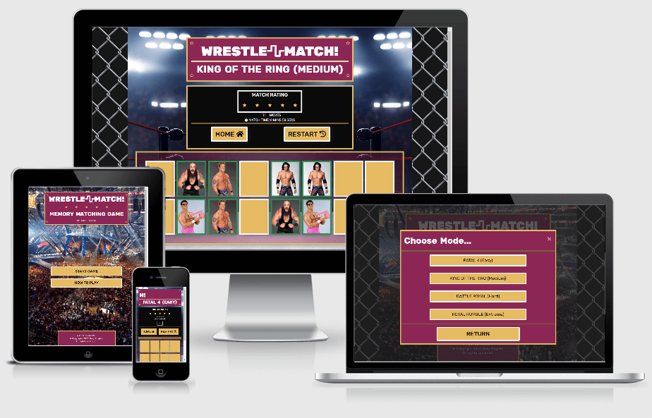

    <h1>WRESTLE~MATCH!</h1>
    <h2>Memory Matching Game</h2>
    Milestone Project 2: Interactive Frontend Development - Code Institute 
    by Gary Hughes

## Introduction

Wrestle Match is a memory game involving the classic card matching mechanic. To win a game of Wrestle Match,
users are required to match pairs of cards with backs facing (to hide the image on the front face) until all cards on the game
board have been revealed. This is a test of a user's short term memory, speed and accuracy as the clock is ticking and the
more matching attempts or moves that are made, the lower star rating the user receives upon completion of their current game.
This game like any typical memory matching game, for it's simple gameplay mechanics, can be enjoyed in short bursts by just
about anybody, unless you just don't like anything to do with the subject of wrestling then this might not be for you. The
real challenge is trying to get a 5-star rating whilst completing a game in the shortest possible time. And although this is
a singleplayer game at it's core, users in the local vacinity to each other can take turns playing the game on a single
device, trying to beat eachothers star ratings and completion times. This particular game will be quite unique, in that the
images on the faces of cards can be a completely different set from one game to the next and this adds much more colour and
variety to the game board aswell as extra replayability as the user doesn't have to see the same small set of imagery each
game they play.

To play WRESTLE MATCH!, click [>>HERE<<](https://gazroh87.github.io/wrestle-match/)

---

## UX (User Experience)

- Does this fit my user's needs?
- Does the user like my website?
- Does the user like being at my website?
- Is this a website a user might want to return to in the future?

These are all questions I asked myself throughout the UX design process.

### User Goals and Expectations

#### Goals for the main users: The Players, and their expectations

- In short bursts, a fun card matching game with flip animation thats very easy for anybody to play with minimal to no
  complications during the process.
- No instructions are really required for anyone to enjoy this game but are provided in any case, without being intrusive.
- An extra appeal to fans of wrestling from the 1980s to the present day.
- Users can enjoy a tried and tested colour palette throughout the main layout of the website thats both pleasant and easy
  on the eyes. Imagery used in the game board during play provides temporary bursts of colour and variety.

User expectations:

- Quickly develop a clear understanding of the website navigation and game mechanics including controls and scoring system.
- The homepage provides quick access to the game via a start button.

#### Goals as the developer

- Develop and deploy a fully intuitive, visually attractive gaming experience that engages with anyone in some way.
- Appeal and gain attention from wrestling fans of old and the current wrestling scene no matter their age.
- Expand my portfolio of coding projects with a website, design and development process I'm confident in and proud of, to
  show to prospective employers.

Developer expectations:

- How does this fit my user's needs? - The controls,mechanics and interactive elements should be obvious to the user.
- Why the user should like my website - Is it visually appealling? There is a continous theme and the colour scheme
  contrasts and compliments well with the overall design.
- Why the user would like spending time at my website? - The game is fun enough to play in short bursts and the variety in
  game modes, and the large array of imagery helps to increase replayability. The user can play alone or compete against friends
  and family.
- Is this a website a user might want to return to in the future? - It ticks all the above boxes and with high reliability
  in the game being accessible and playable on any device with an up to date browser, these reasons should be able entice some
  users to return in the future.

### User Stories

- As a new visitor to this website, I want to easily navigate around the site, so I can traverse efficiently.
- As a new visitor, I would like to be able to easily understand how to play the game.
- As a new visitor, I would like to Quickly recognise any interactive elements and build an understanding of how one thing
  leads to another so the website flows well.
- As a new visitor, I want responsiveness and a consistent design so I can play the game on a range of devices and screen
  sizes and not be confused by any unnecessary, drastic changes.
- As a returning visitor to this website, I would like to see some form of variation to what I have previously seen whether
  it's just different art work or new animations or game modes in the form of updates so I can get increased replayability.
- As a developer, I wanted to make my first game as gaming has always been my favourite activity in my spare time. Wrestling
  is another interest of mine so this has been an easy way of killing two birds with one stone.
- As a developer, I want to have options for projects I can continue to build on with updates introducing enhancements and
  additions in aesthetics, gameplay, sound and so on as I continue to gain experience and expand on my skills.
- As an employer, I want to see what Gary is capable of doing as a software developer by seeing clear and proper usage of
  JavaScript to produce user interatice elements as is to be expected from an IFD project. IF he impresses me with what I see
  this might help me to decide if he is a good fit for an available position within our company.

### Design Choices

#### Colour Scheme

- First colour is the dominant/primary element colour throughout the website. This colour is a good fit for various reasons.
  It works well with background images, the gold accent colour, wrestling company logos I might add in
  future and its a colour that works well with the theme of wrestling.
- Second colour is the accent colour throughout the website.
- Third colour is the main text colour.
- Fourth & fifth colours are the contrasting neutral colours to use where necessary.
- Sixth colour:

#### Typography

- Rubik is the font I have chosen to use for headings.
- Roboto is the font I have chosen to use for all other text.
- These fonts are imported via the head element of a html file from Google Fonts.
- Sans-serif is the fallback font if for some reason the above fonts can't be imported into the site correctly.
- Both the Rubik and Roboto fonts are very popular in the developer world and are also very easy to read, so they are both
  attractive and appropriate.

#### Icons/Imagery

- Font Awesome was used to import icons into the website.
- In the real world, professional wrestling matches are generally rated using an 'out of 5 stars' rating system so it made
  sense to incorporate star icons into the design as visual feedback as to how the player performs during a game.
- The background images I chosen for this website fit the professional wrestling them perfectly and add a little immersion
  and enticement to play the game.
- The card images add lots of different colour, some very vibrant and others not so, but this occurs in short burts and adds
  variety without really detracting from the overall colour scheme.
- In conclusion I feel all the icons and imagery in combination with the colour scheme and typography produce a modern and
  attractive looking design.

### Strategy

The focus of this project is on using the knowledge I have learned of JavaScript to build a responsive application in this
case a card matching memory game to demonstrate to anyone my capabilities in JavaScript alongside HTML and CSS. This game had
to provide some fun and be memorable for some uniquesness.

### Scope

Now I would bucket my features into separate lists by priority:

1. 'Will Do' features had to be completed by my given submission deadline for this project. These have one or both of
   the following characteristics:
   _ Upper bound: Meet the requirements of a project based on the project specifications.
   _ Lower bound: Show as much prowess in course material as possible. Show that I can use the different facets of
   each language (HTML/CSS/JS).
2. 'Stretch Goals' are features to try to implement if I had time left at the end of the project. These should be
   relatively quick and easy to implement but only if the above features have been completed.
3. 'Won't Do' features are features I won't get done before the project deadline but are features I may want to work
   on in the future and include in future updates.

### Structure

I knew I had to limit what functions and mechanics I wanted to include if I was to finish this project by the final
submission deadline. WEBSITE LAYOUT/PAGE DESCRIPTIONS HERE

### Skeleton

#### Wireframes

Listed below are the mobile, tablet and desktop wireframes for my website, created using the Balsamiq Wireframes
application. These wireframes were produced to show the planned differences in appearance between large and small
screen sizes, but please note that they do not reflect a 100% replicated end result of my website and were only used
as an original concept design to get the layout of each part or particular feature of my website started.

1. Mobile Wireframe - [Click to View](https://github.com/Gazroh87/wrestle-match/blob/master/wireframes/mobile-wireframe.png)
2. Tablet Wireframe - [Click to View](https://github.com/Gazroh87/wrestle-match/blob/master/wireframes/tablet-wireframe.png)
3. Desktop Wireframe - [Click to View](https://github.com/Gazroh87/wrestle-match/blob/master/wireframes/desktop-wireframe.png)

---

## Features

### Current Features

- Two page website consisting of a homepage and the game page where a score panel and board where cards are laid out.
- Responsiveness to all device sizes makes the website easily accessible and simple to navigate.
- Predominantly JavaScript powered interactive elements.
- All interactive elements have a slightly different visual appearance when in a hover state.

#### Homepage

- At the top of the page is a header section containing the name of the website which always serves as a link back to
  the homepage and a subheading telling the user the nature of this website. I wanted the website name to always remain
  on a single line and still be fairly large in size so for smaller screen widths I used a scrolling animation on the text.
- On smaller screen widths a background image of a filled wrestling arena also uses a scrolling animation similar to
  a camera panning back and forth across a crowd.
- In the center of the page are two main menu buttons.
- The 'START GAME' triggers a modal to open where the user chooses
  a mode/difficulty setting before proceeding to the game page. Alternatively the user can select the 'RETURN' button
  below these options, to go back to the main menu.
- The 'HOW TO PLAY' button triggers a different modal to open that provides the user with instructions on how to navigate
  around the website, how to play the game and how the score system works. Again the user can select the 'RETURN' button
  below the instructions, to go back to the main menu, for consistency, or the user can select the 'PLAY' button to open
  the 'Choose Mode...' modal to choose a mode/difficulty setting before proceeding to the game page.
- At the bottom of the bottom of the page is a footer section with copyright.

#### Game page

- The top of the page again features a header section with the same website name text and link, then just below it,
  depending on the game mode selected from the main menu of the homepage, the name of the mode and it's difficulty will
  appear as the subtitle text providing clear indication to the user where they are within the website. They can be sure
  that what they click on will take them where they are supposed to go.
- Below the header is the score panel section which houses the match rating box, number of moves made, game duration
  timer, and 'HOME' and 'RESTART' buttons. The 'HOME' button allows the user to return to the homepage and the 'RESTART'
  button resets the whole game to before it began, so the cards selected from a larger deck are randomized and shuffled
  and their positions are also randomized again.
- Below the score panel is the game board. The game board is where the cards in play are laid out with the card face
  images facing away and hidden from the user before the game starts. The number of cards in play are set to 4 pairs of
  cards totalling 8 on the easy game setting and up to 30 pairs of cards totalling 60 on the extreme game setting.
- The game begins when the user selects their first card to flip over and the clock starts ticking. Cards are animated
  using CSS linked to JavaScript event listeners.
- Each matching attempt of two cards is classed as one move made and the more moves the user makes before finishing a
  game, the lower match rating they will receive as stars are deducted at certain move count thresholds. An unlimited
  number of moves can be made and there is no time limit in place to complete a game.
- By deafult cards have a white border. When a matching attempt is made, the selected card's borders will either turn
  red, indicating a failed match or green, indicating a successful match.
- Once all cards have been matched, all card borders will be green and a modal will pop-up in the center of the screen
  declaring the user as a winner and detailing some game stats including how many pairs found, how long it took the user
  to finish the game, number of moves made and the user's final match rating out of five stars. Below the stats is a
  button asking the user if they would like to start a new game straight away.
- Again at the bottom of the bottom of the page is the same footer section.

### Future features/improvements to be implemented

- Add a new game mode that sees users trying to match members of tag-teams together. So here, the images to match would be
  different and instead, to help those unfamiliar with professional wrestling, text on the cards indicating which tag-team
  the person in the image is/was apart of, would be provided. The text might be an option to toggle on or off to increase or
  decrease the challenge.
- Implement sound effects/music.
- Add better/more animation especially to the cards.
- Spend more time on the layout of elements.
- Implement a high score leaderboard. The user would submit a form with some way to identify themselves and update the
  leaderboard.
- Make further improvements to accessibility and performance.
- Existing or aadditional game modes could be added with different visual themes.
- Experiment with automated testing using Jasmine.

---

## Technologies used

### Languages

- HTML5 - used to build the basic layout of the website.
- CSS3 - used for styling and formatting the base HTML code to personalise my website.
- JavaScript - used for adding functionality and user interactivity to the website.

### Frameworks, libraries, editors and version control

- [Bootstrap 4.5.3 CDN](https://getbootstrap.com/) - Bootstrap was used to assist with some of the structuring and responsiveness
  of the website and build off of or modify some of it's existing components and styling to save time.

- [Google Fonts](https://fonts.google.com/) - Google Fonts were used to embed and link the 'Rubik' and 'Roboto' fonts into the HTML.

- [Font Awesome](https://fontawesome.com/) - Font Awesome was used to provide the icons throughout the website for aesthetic
  and UX design purposes.

- [jQuery 3.5.1](https://jquery.com/) - jQuery comes as part of the Bootstrap framework.

- [Git](https://git-scm.com/) / [Gitpod](https://www.gitpod.io/) - Git was used for version control by utilizing the Gitpod IDE
  terminal to commit files to Git and push them to GitHub. Gitpod was the primary development tool for the building and maintenance
  of the website.

- [GitHub](https://github.com/) - GitHub is used to store the project's code within a repository including all previous
  versions or commits of the project after being pushed from Gitpod and is used to host the deployed website for public viewing.

### Additional tools/apps

- [HTML Color Codes](https://htmlcolorcodes.com/) - HTML Color Codes was used to help choose the colour scheme and obtain
  the relative hex codes for each colour.

- [Coolors](https://coolors.co/) - Coolors was used to quickly get 'inbetween' colours and relative hex codes and save my
  chosen scheme as an image.

- [Shutterstock](https://www.shutterstock.com/home) - Shutterstock provided the ring and steel cage background images.

- [Adobe Illustrator](https://www.adobe.com/uk/products/illustrator.html) - Adobe Illustrator was used for testing colour
  and shading compatibility with my chosen colour scheme and tweaking if desired. It was also used for cropping and scaling
  images.

- [Balsamiq Wireframes](https://balsamiq.com/wireframes/) - I used the Balsamiq Wireframes desktop application to create all
  my [wireframes](https://github.com/Gazroh87/wrestle-match/tree/master/wireframes) during the design process.

- [tiny jpg](https://tinyjpg.com/) & [tiny png](https://tinypng.com/) - These websites were used to compress the images used
  throughout the website to reduce data size, decreasing load times without sacrificing the integrity or quality of the original
  images.

- [Google Chrome DevTools](https://developers.google.com/web/tools/chrome-devtools) - The Chrome DevTools were used throughout
  the building, testing and debugging of the website to quickly see the result of any changes made to any code via visualization
  in a live browser tab and/or the developer console.

- [Google Lighthouse](https://developers.google.com/web/tools/lighthouse/?utm_source=devtools) - Google Lighthouse was used for
  website auditing. This addon of DevTools can generate a report of each web pages performance, accessibility, best practices
  and SEO to aid in the testing and improvement of my website.

- [Autoprefixer CSS](https://autoprefixer.github.io/) - Autoprefixer was used to help with making the CSS code compatible and
  valid for all internet browers as much as possible.

- [Am I Responsive Design?](http://ami.responsivedesign.is/) - This web tool was used to generate screencaps of my website at
  different viewport sizes to form a static demo presentation of my website's responsiveness as can be seen towards the top of this
  document.

---

## Testing

### User Story Testing

---

## Deployment

My project was deployed directly from the master branch to GitHub Pages as the website host. Whenever new commits are made to
the master branch the deployed site will update to the latest version. In order for the project to deploy successfully on
GitHub Pages, the landing page has to remain as 'index.html'.

### GitHub Pages

I deployed my project to GitHub Pages using the following steps...

1. Log in to GitHub, locate Repositories then click on the repository .
2. Locate the "Settings" button at the end of the horizontal menu and click to go to the settings page.
3. Scroll down the settings page until you find the "GitHub Pages" section.
4. Under "Source", click on the dropdown menu, set as "None" by default and change it to "master branch" from the available list of options.
5. The page will automatically reload, with a ribbon notification stating: "GitHub Pages source saved" indicating a successful deployment.
6. Above "Source", click the link next to "Your site is published at ".

### Making a Local Clone

To run this repository locally, you can clone this repository directly into the editor of your choice by pasting
`git clone https://github.com/Gazroh87/wrestle-match.git` into your terminal and hit 'Enter'. To cut ties with this
GitHub repository, type `git remote rm origin` into the terminal and hit 'Enter'.

---

## Credits

### Code

### Content

### Media

### Special thanks / Acknowledgements

- And just a big thank you to everyone involved with Code Institute, the mentors and fellow students on Slack who have
  helped to make this project possible.

---

## Disclaimer

This project was created for educational purposes only, for submission to the Code Institute Full Stack Software Development Course for IFD Milestone 2 project grading.

To run a frontend (HTML, CSS, Javascript only) application in Gitpod, in the terminal, type:

`python3 -m http.server`

A blue button should appear to click: _Make Public_,

Another blue button should appear to click: _Open Browser_.
